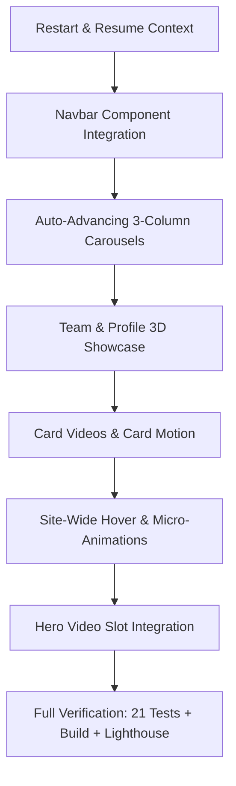

# Lee Monarc — Execution & Enhancement Plan

**Date:** 26 September 2026  
**Repository:** [https://github.com/ktg-one/leemonarc2.git](https://github.com/ktg-one/leemonarc2.git) (`main`)  
**Status:** All 21 Playwright tests green (100%), Turbopack production build passing, ThreeUI button integrated.

---

## 1. Objectives & Active Backlog

Following the Paraform design rhythm and verbatim copy rules from `docs/CANON-BRIEF.md`, this plan details the remaining visual and interactive enhancements.

### A. Hero Video
- **Requirement:** Wide 16:9 / responsive cinematic hero background video loop with dark luxury overlay.
- **Implementation:**
  - Configurable `<video>` element with `playsInline`, `autoPlay`, `muted`, `loop`.
  - Accessible pause/play toggle button.
  - Poster fallback for slow network or `prefers-reduced-motion`.
  - Staging slot ready for final client video asset.

### B. Card Video (x2) & Card Motion Graphics
- **Requirement:** 2 dedicated card video / motion modules in the dark bento grid sections.
- **Implementation:**
  - Staged video slots in dark bento cards (e.g., About Us pull-forward / advisory relationship preview).
  - Rich CSS/WebGL layered card animations with smooth interactive perspective shift.
  - Video play controls or subtle ambient loop without audio.

### C. Site-Wide Motion & Micro-Interactions ("Animations Everywhere")
- **Requirement:** Fluid, high-end feel matching luxury advisory standards.
- **Implementation:**
  - Scroll-driven / intersection-observer reveals (`fade-up`, `stagger-fade`).
  - Subtle floating / breathing effects on graphical badges and icons.
  - Smooth tab switching on desktop feature rotation (6-second cadence).
  - Clean fallbacks respecting `prefers-reduced-motion: reduce`.

### D. Auto-Advancing 3-Column Carousels
- **Requirement:** All 3-column content sections converted to smooth, auto-advancing carousels.
- **Targets:**
  1. **Belief Statements Carousel (Page 4):** 4 editorial belief cards with center card focused, side cards dimmed, auto-panning smoothly on a timer.
  2. **Advisory Pillar Carousel (Page 4/5):** 3 decision pillar cards with auto-rotation, pagination indicators, and manual pause/resume.
  3. **Clarity / Service Bento Carousel:** Auto-sliding cards with pause-on-hover.
- **Controls:**
  - Pause automatically on user hover and keyboard focus.
  - Manual touch/drag and arrow navigation supported.

### E. Comprehensive Hover Effects ("Hovie Effect")
- **Requirement:** Every interactive and container element possesses tactile, luxury feedback.
- **Treatments:**
  - **Cards:** Inset gold border glow, subtle elevation (`translateY(-4px)`), ambient shadow expansion.
  - **Buttons:** Gold shimmer, illuminated star icon pulse (ThreeUI style).
  - **Links & Nav Items:** Sliding underline or warm brass text-fill animation.
  - **Badges & Tags:** Border brightness transition and background micro-tint.

### F. Navigation Bar Input & Integration
- **Requirement:** Integrate Kevin's incoming navbar component replacement.
- **Implementation:**
  - Prepare slot in `src/components/site-header.tsx` / `refresh.css`.
  - Ensure compatibility with `assets.spec.ts` (cold load `header` has `position: relative`, switches to `position: fixed` when scrolled).
  - Mount `<GoldGlowButton />` for main call-to-action.

### G. Team Area with Profiles
- **Requirement:** Meet the Team section with centerpiece profile and profile cards.
- **Implementation:**
  - **Centerpiece Profile:** Vivienne Lee, Founder & Chartered Accountant, 13 years advisory experience, scaled 3D card presentation.
  - **Side Profile/Service Cards:** Formatted as structured advisory profile cards without fabricating non-existent staff (ready to accept new team members when provided).
  - Clean interactive modal or expandable bio cards.

### H. Hero Bottom Strip: Past Client Brands Row
- **Requirement:** Past client brand logos/marks across corporate advisory clients (replacing industry categories).
- **Implementation:**
  - Dedicated brand logo showcase strip with clean monochrome/gold mark styling.
  - Stable reserved geometry (`min-height`) ensuring 0 layout shift (CLS < 0.01).
  - Staged with clean placeholders labeled `Client brand logos · approval pending` ready for Vivienne's brand files.

---

## 2. Execution Sequence

---

## 3. Verification Gates
1. `npm run typecheck` — 0 TypeScript errors.
2. `npm run lint` & `npm run oxlint` — 0 linting errors.
3. `npm test` — 21 of 21 Playwright tests passing (cold load, mobile, contrast, touch).
4. `npm run build` — Clean Turbopack production compilation.
